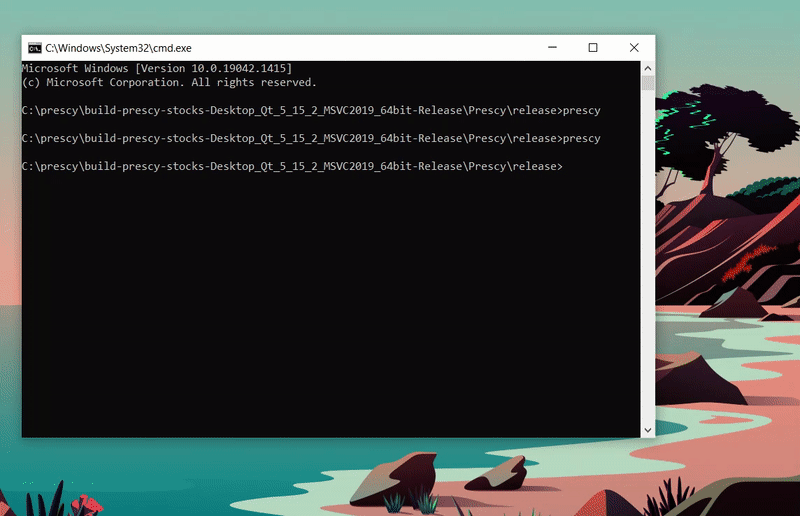

## **A cross-platform live stock monitor with user-generated run-time evaluated indicators**



### **Multithreaded stock querying via curl**

Stock data is pulled every ten seconds from the [Yahoo Finance API](https://finance.yahoo.com/quotes/API,Documentation/view/v1/). The work is distributed between available threads.

### **Indicators using Lua expression evaluation**

[Lua](https://www.lua.org/) expressions are also evaluated every ten seconds. Data is pushed onto the Lua stack in nested tables. When stock data is refreshed, the Lua expression is evaluated. The result is shown to the right of each stock. So long as the syntax is correct and the necessary data is present, expressions can comprise any valid script.

#### Percent Changed

```lua
setResult( (data[__size - 1].close - data[0].open) / data[__size - 1].close * 100 )
```

#### Modified Moving Average

 ```lua
function mma(i)
  if i == 0 then 
    return (1 / __size) * data[i].close
  else
    nextIterationResult = mma(i-1)
    return nextIterationResult + (1 / __size) * (data[i].close - nextIterationResult)
  end
end

setResult(mma(__size - 1))
 ```

### **Graphs drawn with Qt**

Graphs are redrawn on every [QWidget::paintEvent](https://doc.qt.io/qt-5/qwidget.html#paintEvent). The line and candlestick data is sourced from the stock queries.
